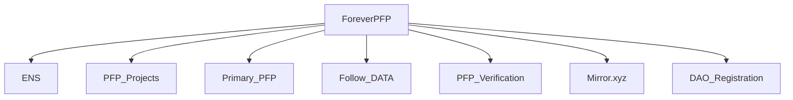

# What is ForeverPFP?
ForverPFP is a project build on some components onchain to connecting web3 people.

(The name is tmp, would happy community can get a better name for the web3 social platform building onchain for connnecting web3 people)

## [ENS](https://github.com/ensdomains/ens-contracts)
Naming service for Ethereum

## [PFP Projects](https://github.com/ForeverPFP/pfp-verification-contract#goerli-testnet-pfp-collection-address)
PFP collections to make web3 people full ownership of their avatars

## [PrimaryPFP](https://github.com/ForeverPFP/primary-pfp-contract)
Set your primary PFP like [Primary ENS Name](https://app.ens.domains/faq#what-is-a-primary-ens-name-record).

## [PFPVerification](https://github.com/ForeverPFP/pfp-verification-contract)
A PFP verification list maintained by the community to avoid PFP image copycats.

## [Mirror.xyz](https://github.com/mirror-xyz)
A content publishing system for web3 users

# Any token in the future for ForeverPFP?

Community can make the decision in the future ERC721 or ERC20 token for governance.
